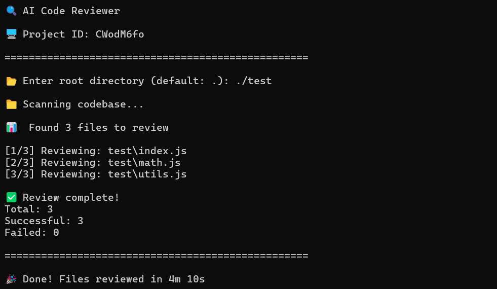

# AI Code Reviewer

A local CLI tool that reviews your codebase using a local AI agent.

This project scans a directory, finds source files, sends them to an AI agent for review, and stores the results in a local database.

## Preview

## Features

- Scans a project directory recursively
- Ignores unnecessary folders like `node_modules`, `.git`, etc.
- Reviews only supported source files (JS, TS, Python, Java, Go, etc.)
- Stores review results in a local database
- Generates markdown reports of each file

## How It Works

1. Provide a root directory (default is current folder)
2. The program scans valid source files
3. Each file is sent to a local AI agent
4. The response is saved:
    - In `_generated/<project_id>/`
    - In `reviews.db`

## Output

Generated reports are stored in `\_generated/<project_id>/`

The database (`reviews.db`) stores structured review data for retrieval.

---

## Notes

- Make sure Ollama is installed and running before using this tool.  
  Also ensure that the model you want to use (e.g. `llama3`, `gemma3`) has been pulled locally and configured in `lib/config.js`.

- Processing time depends upon your system hardware, the size of the codebase, and the model you are using.
